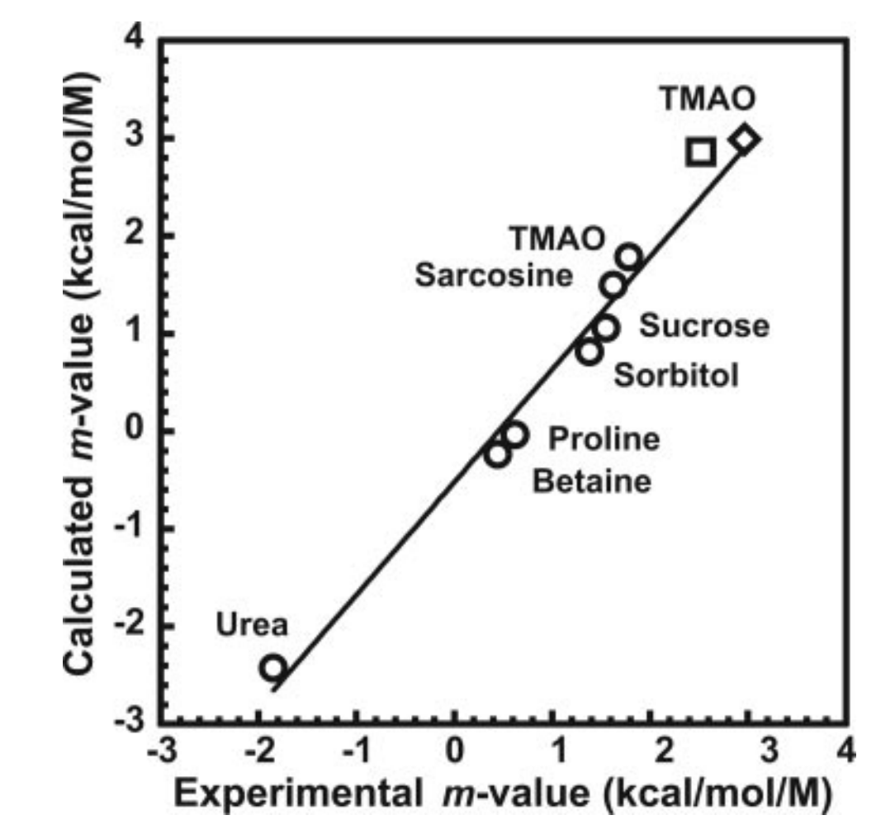

>>>
+ Adenylate kinases are enzymes that catalyze the 
  interconversion of ATP, ADP, and AMP.
+ They are critical regulatory molecues that maintain ATP homeostasis.
+ There functional cycle is like a clamshell. When open, a substrate can dock.  
  The clamshell then closes, bringing the active site residues into position. 
>>>
<iframe width="560" height="315" src="https://www.youtube.com/embed/KUyB1YTqcp4?rel=0&amp;showinfo=0&amp;start=14" frameborder="0" allow="autoplay; encrypted-media" allowfullscreen></iframe>
>>>
You want to design a competitive inhibitor of this enzyme. 
+ Brainstorm a list of the factors you must consider when designing
  such a drug. 
+ How would you model/calculate/estimate the contribution of each of these 
  factors in the design process?  
>>>
>>>
$$\Delta G^{\circ} = \Delta H^{\circ} - T \Delta S^{\circ}$$
>>>
###Paper
Auton & Bolen (2005) *PNAS* 102(42):15065-15068
>>>
How did you guys approach reading this paper?
>>>
What is the overarching goal of this paper?

To calculate protein energetics in terms of solvent accessible surface area

>>>

>>>

>>>

>>>

>>>
Simple models can (sometimes) give you quantitative understanding of 
biomolecular function.
