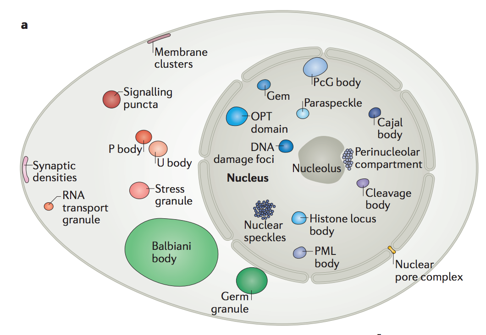
>>>
 height="50%" width="50%" controls
>>>
 height="50%" width="50%" controls
>>>
 height="50%" width="50%" controls
>>>
 height="50%" width="50%" controls
>>>
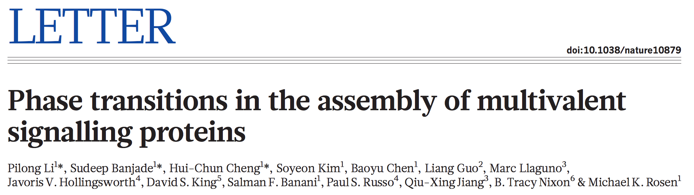
>>>
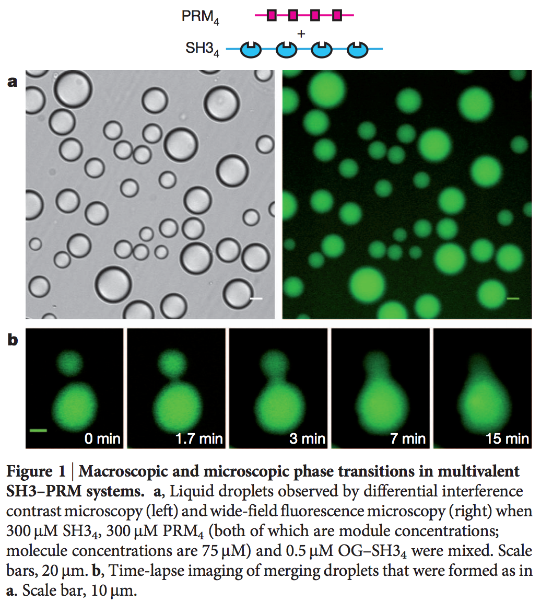 height="50%" width="50%"
>>>
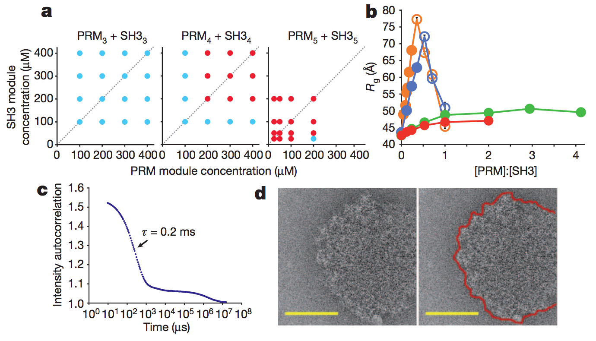
>>>
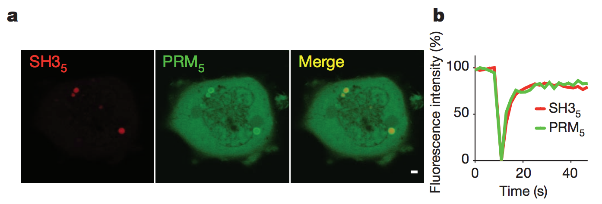
>>>
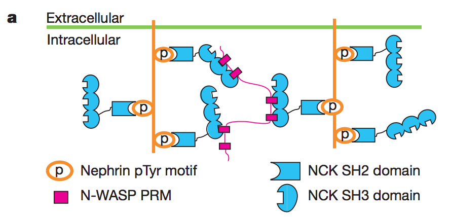
>>>
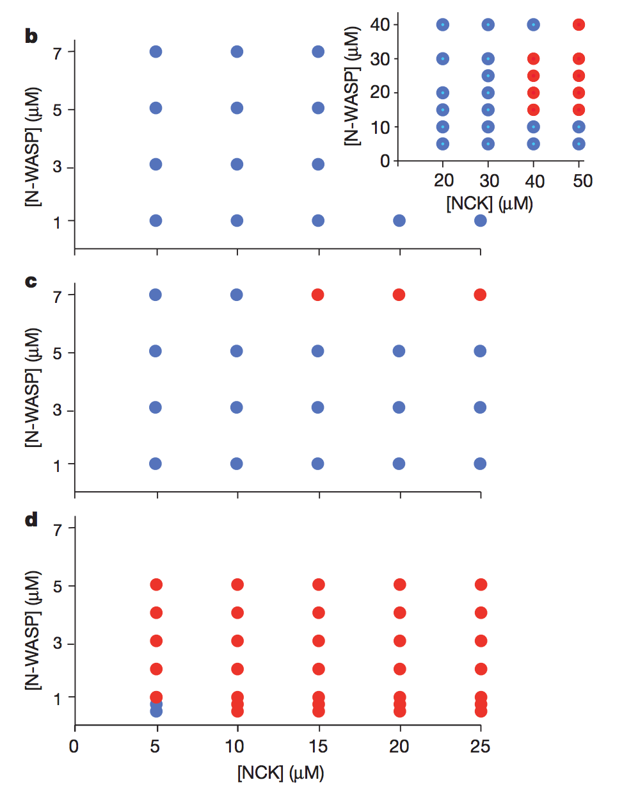 height="50%" width="50%"
>>>
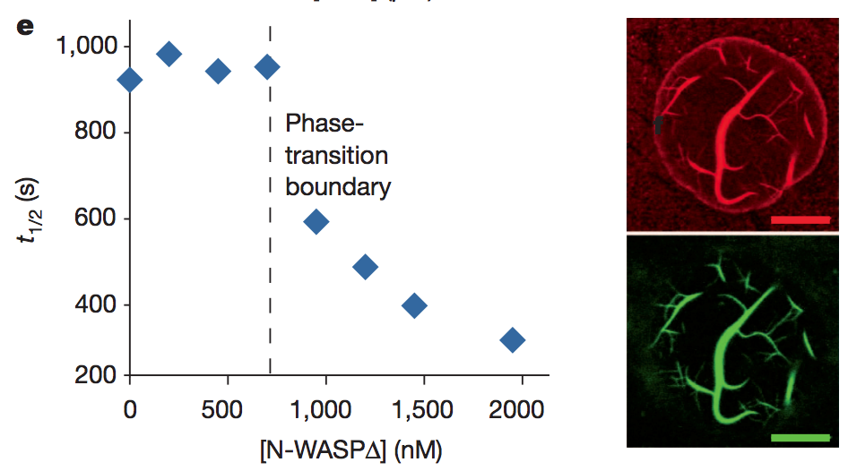
>>>
 height="50%" width="50%" controls
>>>
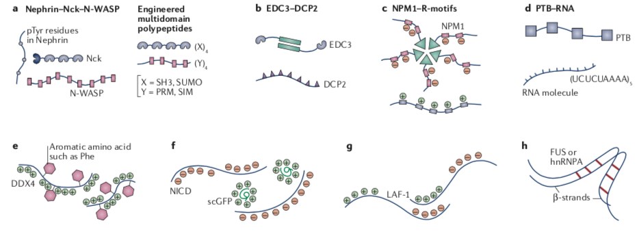
>>>
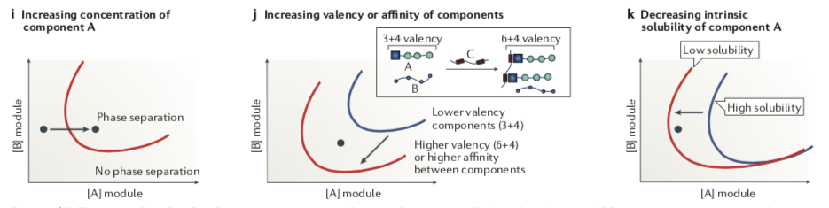
>>>
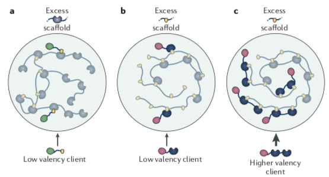
>>>
Liquid-liquid phase transition
+ Is a ubiquitous form of regulation in cells
+ Is driven by weak, multivalent interactions between molecules
+ Can recruit specific clients to specific locations *without* membranes

