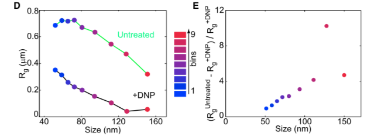

>>>
>>>
Life operates at low Reynold's number.
>>>
<iframe width="560" height="315" src="https://www.youtube.com/embed/rhZf_x8Esms" frameborder="0" allow="accelerometer; autoplay; encrypted-media; gyroscope; picture-in-picture" allowfullscreen></iframe>
>>>
<iframe width="560" height="315" src="https://www.youtube.com/embed/1wNmtle6qkE?start=148" frameborder="0" allow="accelerometer; autoplay; encrypted-media; gyroscope; picture-in-picture" allowfullscreen></iframe>
>>>
At cellular length scales, random walks dominate motion.

<iframe width="560" height="315" src="https://www.youtube.com/embed/hUgwSMUxP5U" frameborder="0" allow="accelerometer; autoplay; encrypted-media; gyroscope; picture-in-picture" allowfullscreen></iframe>
>>>

>>>
Movement of large protein structure stops when growth stops
 height="50%" width="50%" controls
>>>
Large protein with GFP tag randomly wanders around the cell
 height="50%" width="50%" controls
>>>
This stops after carbon starvation
 height="50%" width="50%" controls
>>>
Maybe this is something to do with the starvation response?
>>>
No: the same thing is seen with addition of DNP (rapidly stopping oxidative phosphorylation) in growing cells
 height="50%" width="50%" controls
>>>
All three scenarios give a similar quantaitive responses

>>>
Maybe it is something specific about this protein?
>>>
No: like the protein, a plasmid randomly moves throughout the cell under growth conditions
 height="50%" width="50%" controls
>>>
Addition of DNP stops plasmid movement
 height="50%" width="50%" controls
>>>
Maybe it is an evolutionary adaptation of bacterial components? 
>>>
No: the same behavior is seen for a foreign, viral particle
 height="50%" width="50%" controls
>>>
It appears that movement in the bacterial cytoplasm depends on metabolic activity. 

<em>This is weird.</em>

>>>
From the authors:

<small>The observation that the motion of cytoplasmic components depends on metabolic activity was surprising, as it appeared inconsistent with diffusion, which is a passive process.</small>
>>>
So what is it?  Maybe it's chromosome related? (Open DNA leading to altered dyamics).
>>>
No: a mutant that clumps chromosomes (leaving open space in cell) looks the same.

>>>
Dynamics are almost indistinguishable in open-space mutant

>>>
Maybe it's a specific motor protein?  
>>>
No: adding drugs disrupting bacterial homologs of actin, tubulin, RNA polymerase, and ribosomes had no effect on motion.

>>>
What the heck is going on?
>>>
Observation: particles still move with DNP, they just don't take long steps any more.

>>>
What if we try different particle sizes?
>>>
Smaller particles (smaller bin) diffuse faster than large particles, even with DNP

>>>
Diffusion of smaller particles changes <em>less</em> than larger particles

>>>
Diffusion of smaller particles changes <em>less</em> than larger particles

>>>
Larger particles appear <em>trapped</em> (non-ergodic).

>>>
This would behave if the cytoplasm became a glass.

Prediction: glasses always exhibit two or more dynamic regimes. 
>>>
Particles are found in either a slow or fast regime -- it looks like a glass!

>>>
Turning off metabolism locally traps large particles.

>>>
Conclusions:
+ For particles larger than 30 nm, bacterial cytoplasm is <em>not</em> a viscous fluid
+ Metabolism "fluidizes" the cytoplasm!
>>>
How does the fluidization occur?
+ Protein dis-aggregation? (Munder et al (2015) eLife)
+ Volume increase? (Joyner et al. (2016) eLife)
+ Chemically propelled proteins? (Dey & Sen (2017) JACS)
+ Phase transitions? (Bangwynne et al (2015) Nature Physics)
+ ...?
